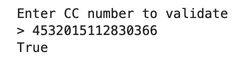

# Credit_card-validator
### [Project_1:Credit_card-validator](https://github.com/PRANAVKUMAR183/Credit_card-validator) (Link to project)

*This tool is designed to validate credit card numbers. It ensures the validity of a credit card number by employing a checksum algorithm known as the Luhn algorithm. This algorithm checks the sum of the digits in the card number to verify if it meets the criteria for a valid credit card.
**Outcome**:

